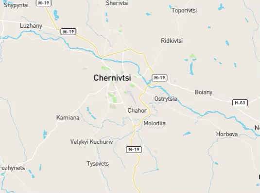

# mapbox-gl-draw-circle-drag

Adds support for drawing and editing a circle drag feature using [mapbox-gl-draw](https://github.com/mapbox/mapbox-gl-draw) library.
Lib based on https://github.com/iamanvesh/mapbox-gl-draw-circle/ , updated and compiled using both ESM, CommonJS modules, with typings.

## Demo



## Usage

### Installation

```
npm install mapboxgl-draw-circle-drag
```

```
import DragCircleMode, { withCircleSupport } from 'mapboxgl-draw-circle-drag';

// userProperties has to be enabled
const draw = new MapboxDraw({
  defaultMode: "drag_circle",
  userProperties: true,
  modes: {
    ...MapboxDraw.modes,
    drag_circle  : DragCircleMode,
    direct_select: withCircleSupport('direct_select'),
    simple_select: withCircleSupport('simple_select'),
  }
});

// Add this draw object to the map when map loads
map.addControl(draw);
```

It fires the same events as the mapbox-gl-draw library. For more information follow this [link](https://github.com/mapbox/mapbox-gl-draw/blob/master/docs/API.md#events).
